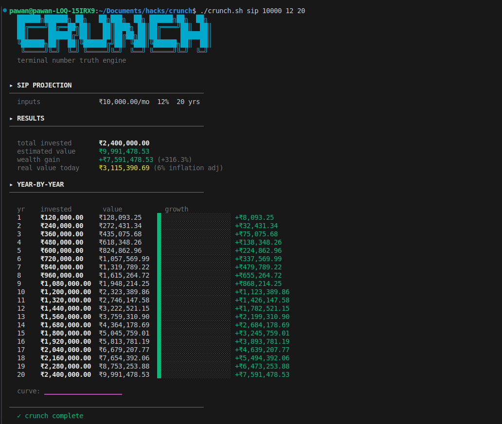
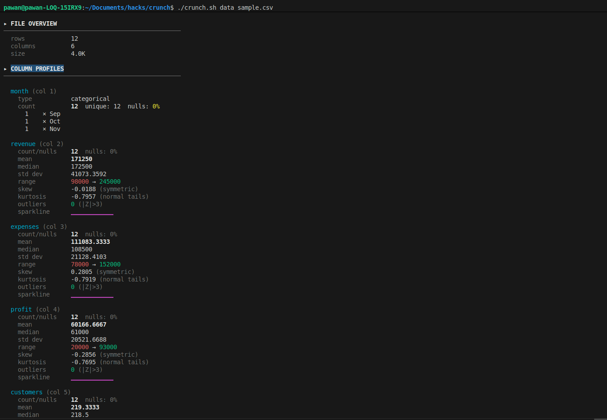
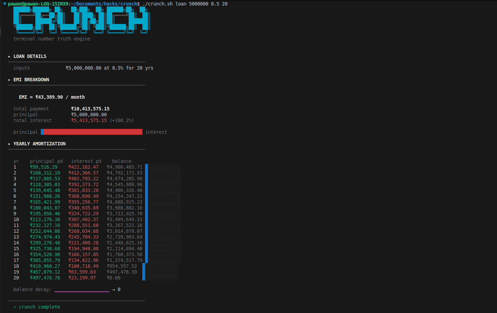
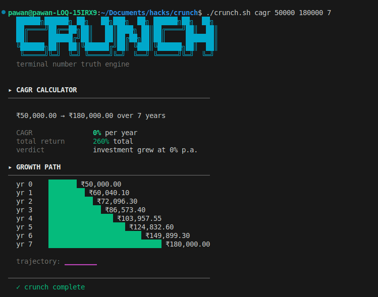

# crunch

**Your numbers are lying to you. crunch tells you the truth.**

Most people stare at spreadsheets and feel nothing. They export CSVs they never open again. They take out loans without knowing how much they're actually paying. They invest without knowing what they're actually getting.

`crunch` is a single Bash script — 240 lines, zero dependencies — that runs anywhere a terminal runs. Feed it data or money. It tells you what's real.

---

## What it does

```
crunch data  <file.csv>                →  full statistical profile of any dataset
crunch sip   <amount> <rate> <years>   →  SIP projection with real vs nominal returns
crunch loan  <principal> <rate> <years>→  EMI + complete amortization table
crunch inf   <amount> <rate> <years>   →  inflation erosion of purchasing power
crunch cagr  <start> <end> <years>     →  compound annual growth rate
```

One tool. Two domains. The same math engine underneath.

---

## Demo Video


[](https://youtu.be/JSDuZWMdKNs)


## Installation

**Prerequisites:** `bash`, `bc`, `awk` — present on every Linux and macOS system by default. Nothing to install.

```bash
# 1. Clone or download
git clone https://github.com/yourname/crunch
cd crunch

# 2. Make it executable
chmod +x crunch.sh

# 3. Run it
./crunch.sh help
```

**Optional — use it from anywhere:**

```bash
# Add to your PATH so you can type 'crunch' from any directory
sudo cp crunch.sh /usr/local/bin/crunch

# Now run from anywhere
crunch help
```

---

## Usage

### `data` — CSV Statistical Profiler

Feed it any CSV. Get column-level statistics: mean, median, standard deviation, skewness, kurtosis, outlier detection via Z-score, null percentage, top categories, and an ASCII sparkline per numeric column.

```bash
crunch data sales.csv
crunch data report.csv
cat data.csv | crunch data        # pipe mode also works
```

<p align="center">
  
</p>

**What you get per column:**
- Numeric → mean, median, std dev, range, IQR, skewness (with direction label), kurtosis (tail weight), outlier count (|Z| > 3), sparkline
- Categorical → count, unique values, null %, top 3 by frequency

---

### `sip` — SIP Projection

```bash
crunch sip <monthly_amount> <annual_rate%> <years>
```

```bash
crunch sip 10000 12 20     # ₹10k/mo, 12% return, 20 years
crunch sip 5000 14 15      # ₹5k/mo, 14% return, 15 years
```

<p align="center">
  
</p>

**What you get:**
- Total invested vs estimated corpus
- Wealth gain in ₹ and %
- Inflation-adjusted real value (6% default)
- Year-by-year growth table with progress bars
- Compounding curve sparkline

---

### `loan` — EMI + Amortization

```bash
crunch loan <principal> <annual_rate%> <years>
```

```bash
crunch loan 5000000 8.5 20     # ₹50L home loan
crunch loan 1200000 11.5 5     # ₹12L car loan
```
<p align="center">
  
</p>
**What you get:**
- Monthly EMI
- Total payment and total interest (the number banks don't advertise)
- Principal vs interest visual bar
- Full year-by-year amortization: how much goes to principal vs interest each year
- Balance decay sparkline

---

### `inf` — Inflation Erosion

```bash
crunch inf <amount> <inflation_rate%> <years>
```

```bash
crunch inf 1000000 6 30     # what ₹10L is worth in 30 years at 6% inflation
crunch inf 500000 7 20
```

**What you get:**
- Real purchasing power of your money in the future
- How much value is silently lost, year by year
- Shrinking bar chart that makes the erosion visceral

---

### `cagr` — Compound Annual Growth Rate

```bash
crunch cagr <start_value> <end_value> <years>
```

```bash
crunch cagr 100000 850000 10    # what CAGR turned ₹1L into ₹8.5L over 10 years
crunch cagr 50000 180000 7
```

**What you get:**
- Annualised growth rate
- Total return %
- Exponential growth path with scaling bars
- Trajectory sparkline

---

<p align="center">
  
</p>

## Quick demo (copy-paste ready)

Generate a sample dataset and run everything in one go:

```bash
# Create sample CSV
cat > sample.csv << 'EOF'
month,revenue,expenses,profit,customers,rating
Jan,120000,85000,35000,142,4.2
Feb,135000,92000,43000,158,4.5
Mar,98000,78000,20000,121,3.9
Apr,167000,105000,62000,203,4.7
May,145000,98000,47000,189,4.3
Jun,189000,112000,77000,234,4.8
Jul,203000,125000,78000,267,4.6
Aug,178000,118000,60000,241,4.4
Sep,156000,102000,54000,198,4.1
Oct,221000,138000,83000,289,4.9
Nov,245000,152000,93000,312,4.7
Dec,198000,128000,70000,278,4.5
EOF

# Run all five modes
./crunch.sh data  sample.csv
./crunch.sh sip   10000 12 20
./crunch.sh loan  5000000 8.5 20
./crunch.sh inf   1000000 6 30
./crunch.sh cagr  100000 850000 10
```

---

## Design constraints

| Constraint | Spec | Status |
|---|---|---|
| Language | Bash only | ✓ |
| Lines | ≤ 400 | ✓ 240 lines |
| Dependencies | Zero external | ✓ bc + awk (stdlib) |
| Crash-proof | All inputs handled | ✓ |
| Modes | 5 | ✓ |

**Error-proof design:** Every mode validates its inputs before touching a single number. Bad values, missing args, empty files, non-numeric data, out-of-range years — all caught and returned as clean error messages. The script never exits uncleanly.

**Math engine:** All floating-point arithmetic runs through `bc -l` (arbitrary precision). Statistical aggregation runs through `awk`. No Python, no Node, no external libraries. The same `calc()` wrapper powers every mode.

---

## Real-world dataset sources

Test with real data beyond the sample:

```bash
# Titanic dataset (~890 rows, mixed types)
curl -o titanic.csv "https://raw.githubusercontent.com/datasciencedojo/datasets/master/titanic.csv"
./crunch.sh data titanic.csv

# Iris dataset (150 rows, pure numeric)
curl -o iris.csv "https://raw.githubusercontent.com/plotly/datasets/master/iris.csv"
./crunch.sh data iris.csv
```

---

## Why Bash

Every other language would have been easier. Python would have been faster to write. Node would have handled edge cases more gracefully.

That's the point.

`crunch` proves that the math doesn't live in the framework — it lives in the logic. When you strip the scaffolding away and all you have left is pipes, `bc`, and `awk`, what survives is what actually matters: the algorithm.

The terminal is where developers already live. A tool that fits there, that costs nothing to run and nothing to install, that works the same on a ₹30,000 laptop and a production server — that's not a limitation. That's a feature.

---

## License

MIT — use it, fork it, alias it in your `.bashrc`.

---

*Built for the Garage Inference hackathon. 240 lines. Zero crashes. Ships.*
